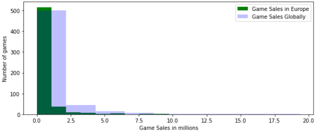

# Video Games Sales Data Analysis

## Overview
This data analysis explores Video game sales over the years on the PlayStation 4 and Xbox One, highlighting trends in sales and market demand for game genres. Through data manipulation techniques, data visualization, and statistical analysis, generating data graphs for distributions, patterns, and highlighting relationships between the genres and market demands for games both globally and locally.

### Results
The Data collection and cleaning process

Graphs generated through data visualization and manipulation

## Technologies Used
Jupyter Notebooks, Python, Pandas, NumPy, Seaborn, Matplotlib

## Resources
The dataset used for this analysis is publicly maintained on [Kaggle](https://www.kaggle.com/datasets/sidtwr/videogames-sales-dataset/data?select=XboxOne_GameSales.csv).

## Disclaimer
This data analysis was developed as part of an academic course at Ontario Tech University. The code is not publicly available to maintain academic integrity.
